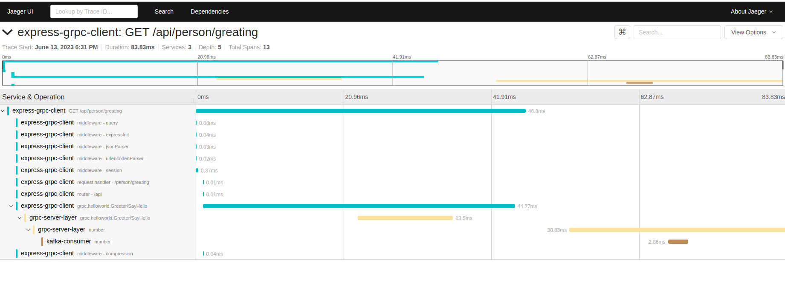

# simple-node-express-grpc-service
Test of grpc service from a client to a server, with the integration of kakfa behind the scenes
Usage of protocolbuffer service/model generation, kafka, node express, jaeger for tracing


# Prerequisite
Download kafka
https://kafka.apache.org/downloads

Install typescript globally
```console
npm install -g typescript 
npm install -g nodemon
```

# how to get started
1. Create a protocol buffer model & compile the source code
```console
npm run build:proto
npm run build
```
2 start kafka
```console
bin/zookeeper-server-start.sh config/zookeeper.properties
bin/kafka-server-start.sh config/server.properties
```
3. start the express_grpc_client, kafka_consumer, grpc_server_layer 
```console
./start.sh
```
   
4. test the greating end-point: 
```console
curl  http://localhost:4040/api/person/greating
```

5. go to the jaeger search interface (see [jaeger](#jaeger))
Go to the following link: http://localhost:16686/search
 


# Jaeger
```console
 docker pull jaegertracing/all-in-one:1.46

 docker run -d --name jaeger   -e COLLECTOR_ZIPKIN_HOST_PORT=:9411   -p 5775:5775/udp   -p 6831:6831/udp   -p 6832:6832/udp   -p 5778:5778   -p 16686:16686   -p 14250:14250   -p 14268:14268   -p 14269:14269   -p 9411:9411   jaegertracing/all-in-one:1.46
```

# some tips
if you want to enable further logging on GRPC use the following command, this can help you debugging the load balancer/DNS lookup done 
```console
GRPC_VERBOSITY=DEBUG GRPC_TRACE=all nodemon express-grpc-client/dist/main
```

